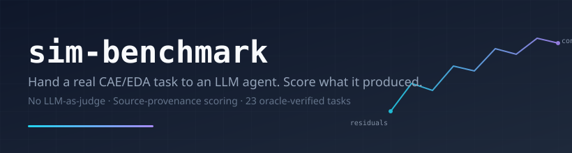

<div align="center">



<br>

> **An industrial simulation agent benchmark.** Hand an LLM agent a real
> CAE/EDA task — meshing, boundary conditions, solver invocation, log parsing,
> KPI extraction — and grade what it actually produced. No LLM-as-judge; the
> verifier re-runs the agent's claimed extraction commands against the
> agent's produced solver artifacts.

<p align="center">
  <a href="#quick-start"></a>
  <a href="#first-reference-runs"></a>
  <a href="LICENSE"></a>
</p>

<p align="center">
  
  
  
  
  
</p>

[What this measures](#what-this-measures) · [Scope](#v01-release-scope) · [Reference runs](#first-reference-runs) · [Quick start](#quick-start) · [Scoring](#how-scoring-works-in-60-seconds) · [Layout](#repository-layout)

</div>

---

## What this measures

Every task hands the agent a natural-language problem statement, a working
container with a real solver installed, and one rule: produce
`/tmp/agent/result.json` whose KPIs come with **source provenance** —
`(value, source.kind, source.path, source.extract)`. The verifier re-runs
each `source.extract` command against the file the agent named and confirms
the value. Hand-written numbers, fabricated logs, and unreproducible KPIs
score zero.

**Out of scope (deliberately).** This is not a knowledge quiz, not a
syntax-of-Fluent test, not an LLM-as-judge tournament. It does not require
the agent to use any specific tool or library — `sim-cli`, native solver
CLIs, Python wrappers, or the agent's own scratch scripts are all valid
launch routes. Tooling is implementation, not the thing being benchmarked.

## v0.1 release scope

| Domain | Tasks | Backing solver |
|---|---:|---|
| Circuits / SPICE | 20 | LTspice (free, open-format) |
| Fluids / CFD | 3 | OpenFOAM (open source) |

Every v0.1 task has a deterministic `solution/solve.sh` oracle that produces
the verifier's upper-bound sanity check. Future releases extend the OpenFOAM
side (turbulent boundary layers, transonic airfoils, multiphase, separated
flows) once their oracles are written and validated.

See [`CASES.md`](CASES.md) for the full catalog with leakage, tier, and
oracle-status flags per case. See [`SCHEMA.md`](SCHEMA.md) for the case /
verifier contract.

## First reference runs

Every task ships with a deterministic `solution/solve.sh` oracle. Running
the oracle gives the verifier's upper-bound sanity check; model rows are
read against that ceiling.

We include first reference runs with MiniMax-M2.5-highspeed and MiniMax-M2.7
through a claude-code harness.

| Suite | Reference models | Read |
|---|---|---|
| LTspice circuits | MiniMax-M2.5-highspeed and MiniMax-M2.7 both land around the 0.9 range | Strong agents can already complete many artifact-grounded circuit workflows. Parameter sweeps and design-selection tasks still discriminate. |
| OpenFOAM fluids | Both MiniMax runs are below 0.5 on the oracle-available CFD subset | CFD remains much harder: agents must author case files, mesh, run solvers, post-process fields, and produce replayable KPI provenance. |

These are reference runs, not a mature cross-model leaderboard. Exact scores,
completion policy, per-case artifacts, and superseded-run notes live in
[`LEADERBOARD.md`](LEADERBOARD.md) and [`results/v0.1/`](results/v0.1/).

The useful early signal is workflow-shaped: artifact-grounded grading
separates agents that can talk about simulation from agents that can produce
solver artifacts that survive replay.

## Why three audiences should care

### For AI / agent companies

A hard, reproducible, end-to-end task suite where the only thing that scores
is **what the model actually produced**, not whether it described the right
answer in chat. Every task is a real solver run with artifact-grounded
grading: the model writes a netlist, runs LTspice, parses the `.log`, and
submits the parse command alongside the value. We re-run the parse. If your
`value` and our re-extraction disagree, you score zero on that KPI.

This gives a clean, commercially-relevant signal that:
- separates models that "know about" vs models that "can complete"
  industrial workflows;
- breaks down by task tier (S/M/L), leakage class, and template
  (measurement / numerical / workflow);
- runs locally with `harbor` + Docker — no submission portal, no API key
  for us, no rate-limited grader.

To publish a leaderboard row, see [`REPRODUCING.md`](REPRODUCING.md). To
see what the harness does on each trial, see [`docs/hooks.md`](docs/hooks.md).

### For CAE / EDA software vendors

Industrial CAE has been "the agent layer is too brittle" for a decade.
This benchmark turns that into a measurable signal — over real cases,
real solver artifacts, real numerical-vs-physical pass criteria — and
makes it possible to talk concretely about *which* parts of the agent loop
fail on *which* solvers.

You can use this to:
- evaluate whether AI agents can drive your solver well enough for
  customer-facing automation;
- benchmark internal solver wrappers / Python APIs against the same task
  suite the open community runs;
- propose new cases via PR — see [`cases/circuits/README.md`](cases/circuits/README.md)
  and [`cases/fluids/README.md`](cases/fluids/README.md) for tier / leakage
  norms.

The contract is in [`SCHEMA.md`](SCHEMA.md).

### For CAE practitioners

If you've been asked "should we put an LLM in front of our solver
workflow", this is a yardstick. Run the oracle smoke (no LLM, free):

```bash
uv tool install harbor
git clone https://github.com/svd-ai-lab/sim-benchmark && cd sim-benchmark
harbor run -p cases/circuits -i rc_highpass_ac --agent oracle -y
# Expect: reward = 1.000, wall-clock ~1 min on Docker Desktop.
```

If that returns 1.0, your environment is sound and any model run you do
will be apples-to-apples comparable to ours. Then run a model — the same
command with `--agent claude-code` (or your wrapper) replacing
`--agent oracle`. See [`REPRODUCING.md`](REPRODUCING.md) for the three
reproduction paths (GHCR pull / build from source / paranoid).

## Quick start

```bash
# 1. install harbor (the runner — same one Terminal-Bench uses)
uv tool install harbor

# 2. clone
git clone https://github.com/svd-ai-lab/sim-benchmark && cd sim-benchmark

# 3. oracle smoke on one circuit (no LLM, no API key)
harbor run -p cases/circuits -i rc_highpass_ac --agent oracle -y

# 4. oracle smoke on a CFD case (also no LLM; needs the OpenFOAM base
#    image — see REPRODUCING.md Path B for local builds)
harbor run -p cases/fluids -i lid_driven_cavity_re100 --agent oracle -y
```

Both should print `reward: 1.000`. If you see anything else, the bug is
in your environment, not in the agent.

## How scoring works in 60 seconds

Every case is verified against a `tests/kpis.json` that lists named KPIs
and how to measure them. The agent submits:

```json
{
  "f_3db": {
    "value": 175.6,
    "source": {
      "kind": "ltspice_log",
      "path": "/root/case/rc_lowpass.log",
      "query": "measure",
      "measurement": "f_3db"
    }
  }
}
```

The verifier opens the file at `path`, runs the declared extraction, gets
the actual measured value, and compares against ground truth (within the
tolerance `tests/kpis.json` declares). Scoring templates per task type:

| Template | Groups | Used for |
|---|---|---|
| `measurement` | setup 0.10 / outputs 0.90 | "measure this circuit" |
| `numerical` | setup 0.10 / numerical 0.15 / outputs 0.75 | "this CFD case must converge" |
| `workflow` | setup 0.15 / process 0.25 / outputs 0.60 | multi-step GUI / artifact tasks |

Total per case is a weighted sum of the per-group means. See
[`SCHEMA.md`](SCHEMA.md) for the formal contract.

## Repository layout

```text
sim-benchmark/
├── cases/
│   ├── circuits/          # LTspice tasks
│   └── fluids/            # OpenFOAM tasks
├── configs/               # release run configs (oracle, M2.7, M2.5)
├── docs/                  # design appendices
├── environment/
│   ├── base/              # OpenFOAM base image
│   └── wine-base/         # LTspice-on-Wine image
├── lib/
│   └── sim_benchmark_verifier/   # the grader (Python)
├── tools/                 # harness, lint, aggregation, scoring helpers
├── results/v0.1/          # published reference-run artifacts
├── CASES.md               # public catalog with status / leakage / tier
├── LEADERBOARD.md         # current and historical results
├── ORACLE.md              # oracle baseline + verifier sanity checks
├── RELEASE.md             # v0.1 release gate
├── REPRODUCING.md         # three reproduction paths
└── SCHEMA.md              # case + verifier contract
```

## Roadmap

- **v0.1 (current)** — deterministic verifier, in-trial Stop hook with
  schema and extract-runnability passes, MiniMax reference rows.
- **v0.2** — broader OpenFOAM coverage (turbulent boundary layer,
  transonic airfoil, multiphase, separated flows); harden Docker Hub
  package distribution.
- **later** — stable schema, public leaderboard, multi-org submission flow.

Track open work on [GitHub Issues](https://github.com/svd-ai-lab/sim-benchmark/issues).

## Contributing

PRs welcome. Two common contributions:

- **A new case.** Use [`tools/new_circuit_case.py`](tools/new_circuit_case.py)
  for circuits or copy an existing fluids case as a template. Run
  [`tools/lint_case.py`](tools/lint_case.py) and the verifier tests
  before opening a PR. See [`SCHEMA.md`](SCHEMA.md) §9.
- **A model harness.** New `agent_harness.py:Agent` subclass; bring your
  own routing layer. See [`tools/agent_harness.py`](tools/agent_harness.py)
  for the existing CC + ccr pattern.

## Citing

```bibtex
@misc{simbenchmark2026,
  title  = {sim-benchmark: An Industrial Simulation Agent Benchmark},
  author = {{svd-ai-lab}},
  year   = {2026},
  url    = {https://github.com/svd-ai-lab/sim-benchmark},
  note   = {v0.1}
}
```

## License

Apache 2.0. See [`LICENSE`](LICENSE).

The repo bundles example assets (LTspice netlists, OpenFOAM mesh files)
that are themselves under their respective upstream licenses; see each
case's `solution/` directory for source attribution.
